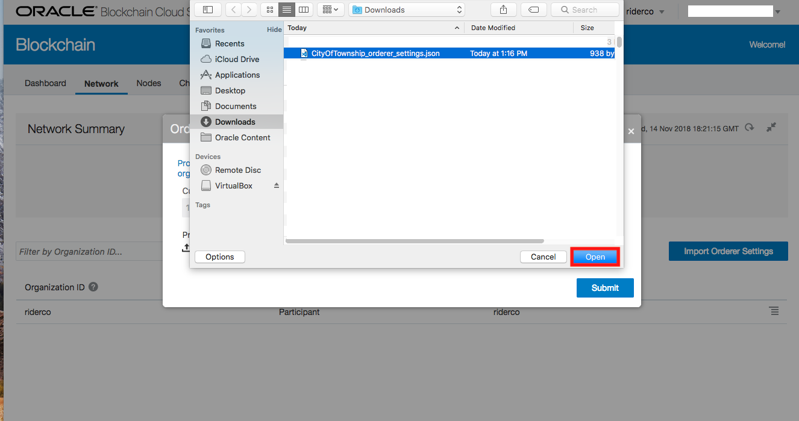
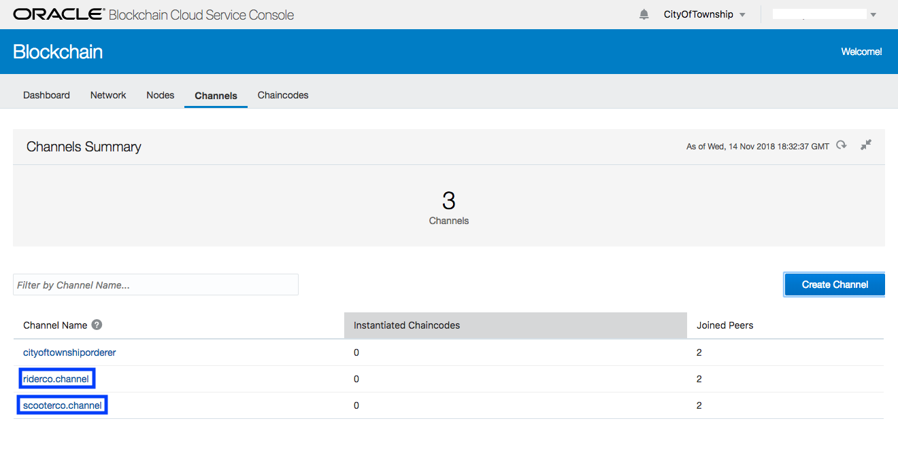
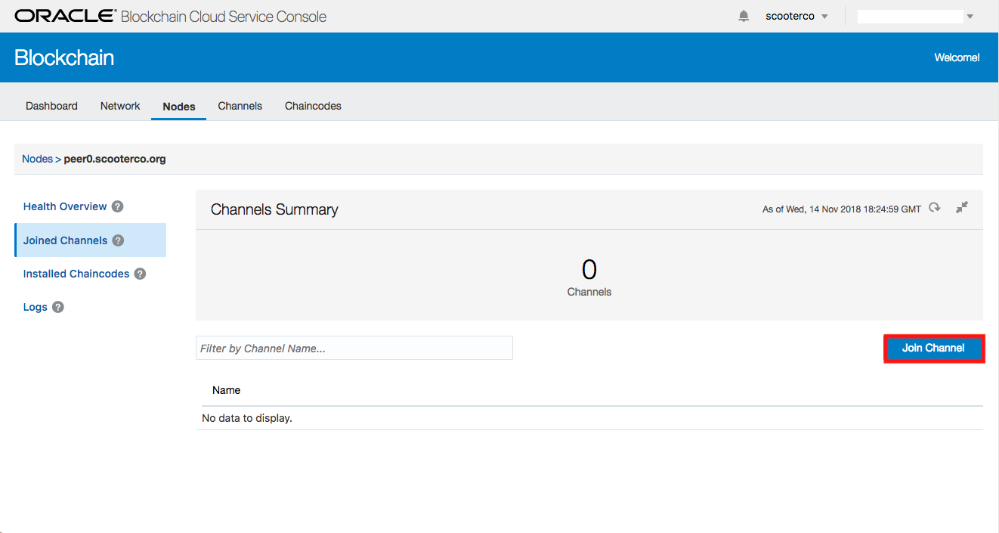
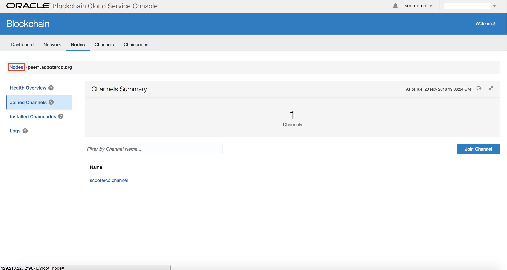
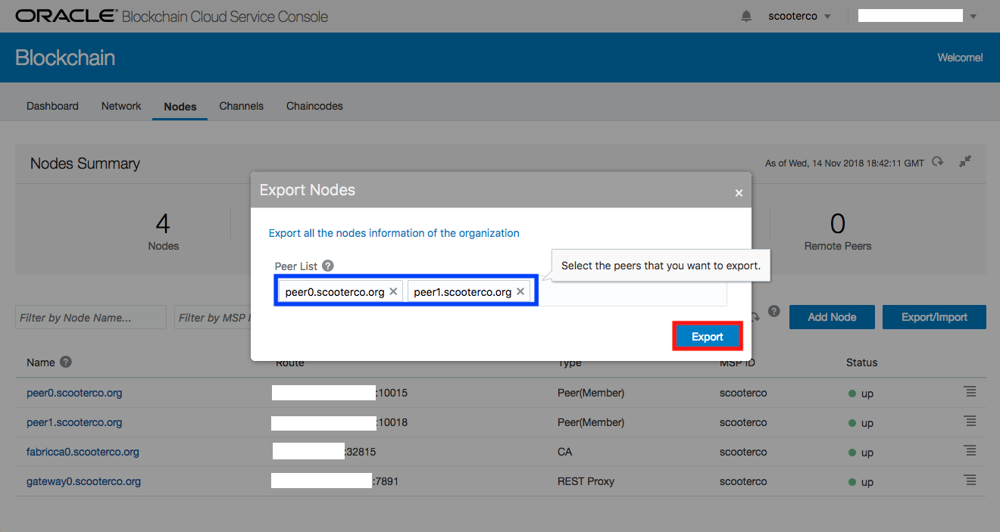

# Lab 100: Creating a Blockchain Network (Docker Version)
## Introduction
This lab will cover setting up the blockchain network. We will create a founder along with two participant organizations.

## Objectives
- Learn how to setup a founder organization
- Learn how to setup a participant organization
- Register the participants by importing orderer settings and exporting certificates
- Create two channels to ensure privacy between the founder and participants

## Required Artifacts
-	The IP address for a virtual machine running the Oracle Blockchain Application.
-	The username and password to access that virtual machine.

---
### Step 0: Login to the Virtual Machine
- Open the URL for the virtual machine. You will see a login page. Enter your username and password.

- You will then see the network provisoning page of the Blockchain Application.

### Step 1: Create Your Blockchain Network

- In the right-hand column on that page, select “Create Block Chain Network”. In the “Organization” section, the fields should contain the following:

* Name – The name for the founder organization. If this example, we use “CityOfTownship”

* Domain – A theoretical domain name for the organization. We use “township.org”.

* Number of Peers – The number of peers in the network. You will need at least 1, we use “2”.

* Host Address – The address that will be used to access the peers, nodes, and console for this network. Since this is being created directly on your virtual machine, you will need to enter the IP address for your virtual machine (without any port information).

* REST Proxy Port – The port at your host address that will be used for the REST proxy (where the rest of the internet can interact with your network and its chaincodes). This should be a number between 3000 and 65000. We used “4567”.

* Console Port – The port at your host address that you will use to access the network console page. This will also needs to a number between 3000 and 65000, and cannot be the same number as the REST Proxy Port. We used “7654”.

* Peer Start Port – The lower port number that can be used for network peers. This is automatically filled with the number “10000” and can remain that way.

* Peer End Port – The highest port number that can be used for network peers. This is automatically filled with the number “65535”, and can remain that way.

* Orderer Port – The port that will be used for the network orderer node. The orderer is a node running the communication service that implements a delivery guarantee. You can read more on orderer nodes at https://hyperledger-fabric.readthedocs.io/en/release-1.3/arch-deep-dive.html. This will also needs to a number between 3000 and 65000, and cannot be the same number as any other provided port. We used “3001”.

* Ordered Type – The type of ordered node that will be created. Select the “Solo” option.

When you are done entering your information, the provisioning page should look like this:

- Click Apply. Since you are using an IP for your host address, you will get a warning message asking you to confirm this option. Click Okay, as we will not need to worry about dynamic IP addresses.

- You will then see the newly-created organization added to the organization list on the left-hand column, and there will be asked to click to manage the network. Clicking that link will open the console for that network.

- You can open that in a new browser tab.

### Step 2: Create the Participant ScooterCo
- Before we do anything on this console, we will need to do a few more things on the provisioning page first. If you accidentally close the tab with this console, you can always re-open it using the link on the organization name on the provisioning page.

- On the provisioning page, you will now select the option to Create a Block Chain Organization.

- We will be creating the “ScooterCo” organization. There are fewer options when creating an organization that is not also a network founder, but all of the same information applies. Also, since we will be operating all organizations on the same host, the REST Proxy Port and Console Port should not be any of the same ports used by your founder network. When you have filled out all the fields, it should look like this:

- You will receive another warning about using an IP address, and can once again click Okay.

- You will be presented with a link to the console for this organization. You can also open this in another tab.

- You will now see the “ScooterCo” organization in your organization list. We will now create the final organization. Select Create Block Chain Organization.

### Step 3: Create the Participant RiderCo

- We will now be creating the “RiderCo” organization. The requirements for the information will be the same as those for “ScooterCo”.

- When the information is entered and you click Apply, the you will receive the final warning about using an IP address for the Host Address.

- Now that this final organization has been created, you can click the link to open the BCS console for the RiderCo organization. If you do not have the BCS consoles open for the ScooterCo and CityOfTownship organizations, you should open them now in separate tabs.

### Step 4: Export the Orderer Settings from the Founder

- If this were a real deployment, one would only have access to their own organization’s console. You may want to imagine, as you move between each of the consoles, that you are taking on the role of that specific organization’s blockchain admin.

- The first console we need to access is for our network founder, CityOfTownship.

- NOTE: Since all of the consoles look very similar, you can always check the upper-right corner of the console to see the name of the organization whose console you are using.

- From the CityOfTownship console, open the Network tab.

- You will see the Network Summary and the list of organizations that are currently part of the network. Currently, on the CityOfTownship itself is part of its network. To add the additional organizations, we will need to click the Menu icon on the right of the CityOfTownship listing.

- A menu will appear and you will need to select the option to Download Orderer Settings.

- A file containing the orderer settings for the CityOfTownship network will be downloaded to your computer. Be sure to note where the file was saved, as we will need it soon.

### Step 5: Import the Orderer Settings to Participant ScooterCo

- Now we will need to access the service console for the ScooterCo organization. If you do not already have this console page open, you can access it from the provisioning page.

- Once you are at the ScooterCo service console, you will need to click the Network tab.

- In the network tab, click the button labeled Import Orderer Settings.

- On the modal that appears, click the link to Upload Orderer Settings.

- Select the orderer settings file that was downloaded previously and click Submit. If this were a production network being provided, this file would have been sent from the CityOfTownship to ScooterCo once they reached an agreement on joining the network.

### Step 6: Import the Orderer Settings to Participant RiderCo

- Now we will need to access the service console for the RiderCo organization. If you do not already have this console page open, you can access it from the provisioning page.

- Once you are at the RiderCo service console, you will need to click the Network tab. These steps will be the same as those undertaken with ScooterCo.

- In the network tab, click the button labeled Import Orderer Settings.

- On the modal that appears, click the link to Upload Orderer Settings.

- Select the orderer settings file that was downloaded previously and click Submit.

### Step 7: Export the Participant Certificates to the Founder

- Now that you have imported the orderer settings, we will need to export the certificates for RiderCo. Click the RiderCo name in the upper-right corner of the console, and then click Export Certificates.

- A file named certs.json will download. Be sure to note where it was saved on your computer.

- Now we will need to turn to the ScooterCo console and complete the same steps for exporting certificates.

- Once again, be sure to note where the certs.json file was saved (depending on your operating system and browser, the certs.json file from ScooterCo may have a name like “certs (1).json”). Now you will need to click the Nodes tab on the ScooterCo console.

<!-- =======================MIGHT NOT NEED

Docker_Image_32.png

TO

Docker_Image_41.png

========================MIGHT NOT NEED -->

### Step 8: Import the Organization Certificates to the Founder

- We will now return to the console for the CityOfTownship. On its Network tab, click the button to Add Organizations.

- On the modal that appears, click the link to Upload Organization Certificates.

- Select the certs.json file from the RiderCo organization.

- Once you see the certs.json file on the list of organizations, click the + button and you will see an option to upload another organization’s certificate. Click that link and select the certs(1).json file for ScooterCo. Once you have added that item, click the Add All button.

- You should now see RiderCo and ScooterCo in the list of organizations within your network. They will have the role of Participant while CityOfTownship is the Founder.

### Step 9: Create the Channels

- Now, we will create the individual channels for our network. Channels allow your blockchain network to allow information to be shared with specific participants. Click the Channels tab for the CityOfTownship console.

- On the Channels tab, click the Create Channel button.

- We will create the channel for RiderCo first. You will need to enter the Channel Name, select the organizations that will take part in the channel, decide on their access level, and choose the peers within your organization that will join this channel.

- In this case, since this channel is to be the private channel between RiderCo and CityOfTownship, we will call it “riderco.channel”. We will select RiderCo and CityOfTownship as members, make sure the both have ReaderWriter access.

- NOTE: Make sure to only select RiderCo and CityOfTownship. If you add ScooterCo to this channel, it will no longer be private between those two members. Now, add both of our peers to the channel. The modal for creating the channel should look like this as you click the Submit button.

- Complete the same steps for ScooterCo, naming its channel “scooterco.channel” and making sure that only ScooterCo and CityOfTownship are members of the group. Once you have created the second channel, your channels page should look like this.

### Step 10: Join the Participant Peers to the Channels

- Now, we need to return to the console for RiderCo so that we can join its peers to riderco.channel. Open the Nodes tab on the RiderCo console, and click on peer0.

- You will see the dashboard for that peer, showing its current status. Click on the Joined Channels link.

- On the Joined Channels page, click the Join Channel button.

- On the modal that appears, enter riderco.channel and then click the Join button.

- Now return to the main Nodes tab, and click on peer1.

- On the dashboard for peer1, click on the Joined Channels link.

- Then click on the Join Channel button.

- Enter riderco.channel and click the Join button.

- We will now follow the same steps for the ScooterCo organization, for scooterco.channel. Go to that console and its Nodes tab.

### Step 11: Export the Participants to the Founder

- Returning to the main Nodes tab, click the Export/Import button and select the Export option.

- Select both of the peers for the organization and click the Export button. Take note of where the node export file was downloaded and what it was named.

- We will now switch to the RiderCo organization’s console, click the Export/Import button under the Nodes tab and select the Export option.

- Once again, select both of the peers for this organization and click the Export button. Also take note of where the node export file was downloaded and what it was named.

- With both of the exported node files ready, switch to the CityOfTownship console. On that console, go to the Nodes tab, click the Export/Import button, and select Import.

- On the modal that appears, click the link to Upload remote nodes configuration.

- Select the most recent node export file for the RiderCo organization.

- Click the + button and then click the new link to Upload remote nodes configuration.

- This time, select the most recent node export file for the ScooterCo organization. Once you have selected that file, click the Import button.

- You should now see each of the RiderCo and ScooterCo peers listed as remote peers. Now click on the graph icon.

- Clicking the graph icon will show you the network topology for your peers and channels. It should look something like this.

- Congratulations! You have completed this lab. When you are ready, go to Lab 200 and we will learn about installing chaincodes (smart contracts).
