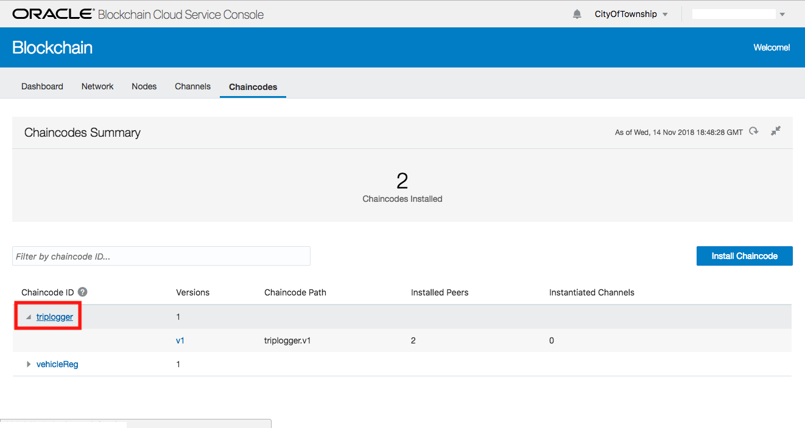
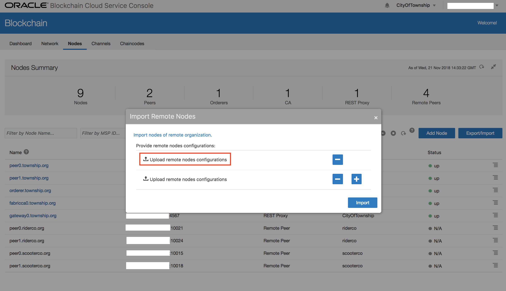
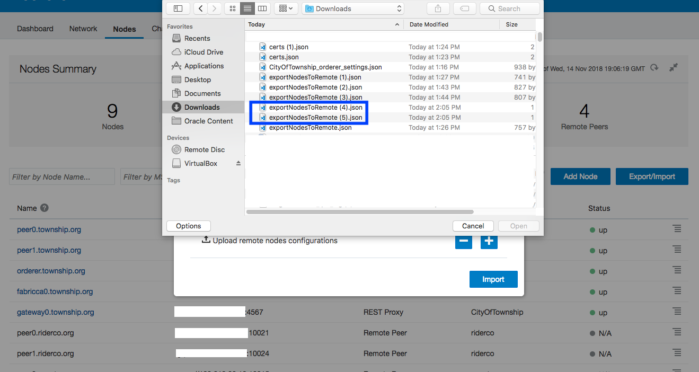
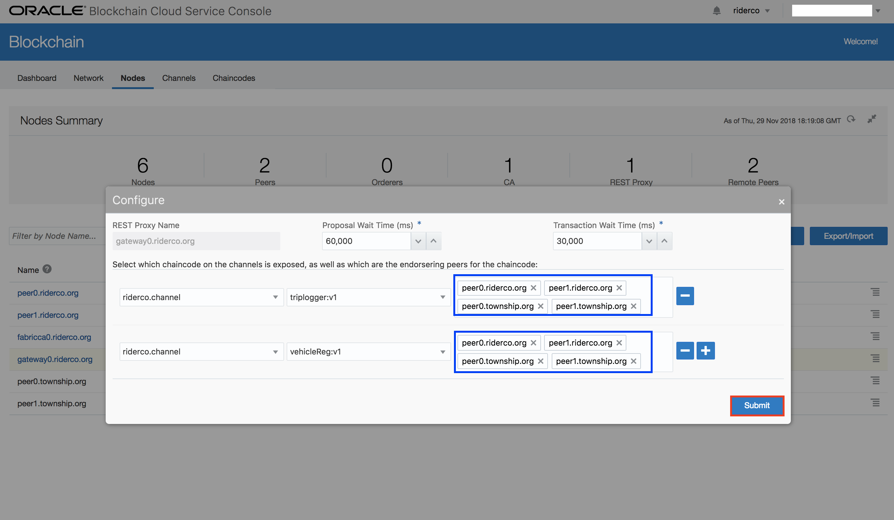
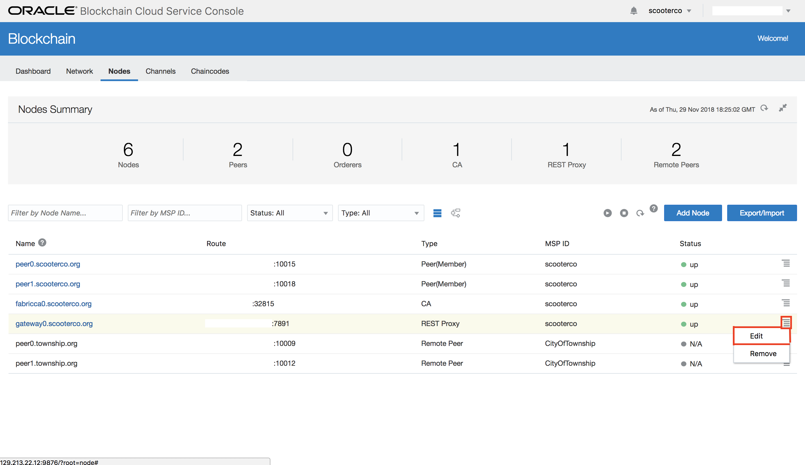

# Lab 200: Install and Instantiate Chaincodes (Smart Contracts)
## Introduction
Chaincodes are programs that implement a prescribed interface for your blockchain network. They typically handle business logic for members of the network, taking on the role of smart contracts. These are the two chaincodes we are going to be installing today:

- vehicleReg – A chaincode for registering vehicles, putting them into/taking them out of service, and tracking their current location.
- tripLogger – A chaincode for recording the trips taken by a vehicle.

## Objectives
- Learn how to install chaincodes to peers
- Learn how to instantiate chaincodes onto channels
- Export nodes to ensure all participants are connected

## Required Artifacts
- Completed Lab 100 and have a Blockchain network with a Founder (*CityOfTownship*) and two Participants (*RiderCo* & *ScooterCo*).
- Have the chaincode files (**tripLogger.go.zip** and **vehicleReg.go.zip**) from the artifacts repository.

---

### Step 1: Install Chaincodes on the Founder

We will start at the service console for the **CityOfTownship** organization. (If you need to see how to access the consoles for your organizations, see [Lab 100](Lab100.md).)

- Open the **Chaincodes** tab and click the **Install Chaincode** button.

- The modal that appears will have default values for the chaincode. We will be overwriting all of these.

- We will start with installing the **tripLogger** chaincode. The fields should contain the following:
  * **Chaincode Name** – The name of the chaincode. We will be using **tripLogger** here.
  * **Version** – The version of the chaincode. We will be using **v1**. This field does not need to contain a number for the version, but we recommend it as this will make things easier when updating the chaincode later.
  * **Target Peers** – The peers where you will be installing the chaincode. Select both of the peers for the organization.
  * **Chaincode Source** – Select **Local** as you will be uploading the file from your computer.

- You will then click the link to **Upload a chaincode file**.

- Select the **tripLogger.go.zip** file.

- Once you have uploaded the file, click the **Install** button.

- You will then need to follow the same steps for the **vehicleReg** chaincode.

- The chaincodes are now installed, but they are not yet available to use. A chaincode needs to be instantiated on a channel for it to be available. On the **Chaincodes** tab, click the **disclosure triangle** next to the **tripLogger** chaincode.

- Make sure the chaincode shows that it is installed on two peers and instantiated on zero channels.

### Step 2: Install Chaincodes on the Participants

- We will now switch to the **ScooterCo** organization’s console, and go through the same installation steps. *It is important that you use the exact same name and version number here as you used on CityOfTownship.*

- Now switch to the **RiderCo** organization’s console, and complete the same installation steps. *Once again, the chaincode name and version number should be the same as those used with CityOfTownship.*

### Step 3: Instantiate Chaincodes on Both Channels

- We can now return to the **CityOfTownship** service console. From the **Chaincodes** tab, click on the **tripLogger** link (the link that is the name of the chaincode, rather than the disclosure triangle).

- You will be brought to the tripLogger chaincode page, showing its versions. Click the **menu icon** on the right of the listing for **v1**.

- Click the option to **Instantiate** the chaincode.

- On the modal that appears, you will need to enter the following:
  * **Channel** – The channel where you are instantiating the chaincode. We will start with **riderco.channel**.
  * **Peers** – The peers that will access this chaincode on this channel. Select both peers for the organization.
  * For the **Endorsement Policy** – Click the **Add Identity** button twice for the two members of the channel that will be using this chaincode. Select the **RiderCo** organization and the **CityOfTownship** organization, and make sure that they have the **Member** role.
  * **Policy Expression Mode** – Select **Basic** here.
  * For the endorsement we will want it to be signed By **2** organizations, meaning that both members in the channel will have to sign a transaction before it is written to the ledger.

- The modal should look like this as you click the **Instantiate** button.

- Once you have instantiated the chaincode on riderco.channel, we will do the same thing for the chaincode on **scooterco.channel**, making sure that only **ScooterCo** and **CityOfTownship** organizations are members.

- Once you have completed the instantiation steps for both channels, the tripLogger chaincode page should look like this.

- We will now go to the **vehicleReg** chaincode page, and complete the same instantiation steps for both channels.

Fortunately, when a chaincode is instantiated on a channel that instantiation happens for all organizations on the channel, so we do not need to instantiate the chaincode again from either of the member organizations. However, we will need to export the peers one more time, so that all organizations know which peers on the network have the chaincodes installed.

### Step 4: Export Participant Nodes to the Founder
- We will now switch to the **RiderCo** organization’s console. From the **Chaincodes** tab on the RiderCo console, click the **disclosure triangle** next to **tripLogger** to see this in effect.

- As you can see, the chaincode is instantiated on our channel. Click the **Nodes** tab.

- On the Nodes tab, click the **Export/Import** button, and select the **Export** option.

- On the modal that appears, select both of the peers and then click the **Export** button. *Be sure to note the name of the file that is downloaded.*

- We will now need to export the nodes for the **ScooterCo** organization. Go to the ScooterCo service console’s **Nodes** tab. From there, click the **Export/Import** button and select the **Export** option.

- On the modal that appears, select both of the peers and then click the **Export** button. *Once again, be sure to note the name of the file that is downloaded.*

- Now return to the **CityOfTownship** service console and go to its **Nodes** tab. From there, click the **Export/Import** button and select the **Import** option.

- On the modal that appears, click the link to **Upload remote nodes configurations** and select the file for the exported **RiderCo** nodes. Then click the **+** button, click the new **Upload remote nodes configurations** link, and select the file for the exported **ScooterCo** nodes.

- Finally, click the **Import** button.

- You will now have the updated remote peers appearing in the Nodes list for the CityOfTownship.

### Step 5: Export Founder Nodes to the Participants

- We will now export the CityOfTownship’s nodes for the other organizations. From the **Nodes** tab, click the **Export/Import** button, and select the **Export** option.

- On the modal that appears, select both of the CityOfTownship’s peers, and click the **Export** button. *Take note of the name of the file and where on your computer it was downloaded.*

- We will now switch to the service console for the **ScooterCo** organization. On its **Nodes** tab, click the **Export/Import** button and select the **Import** option.

- On the modal that appears, click the **Upload remote nodes configuration** link.

- Select the file containing the expored peers for the **CityOfTownship**.

- Then click the **Import** button.

- You will now see the remote peers on ScooterCo’s peer list.

- We will now complete the same steps to import the CityOfTownship’s peers to the **RiderCo** organization.

### Step 6: Configure the Founder's Rest Proxy

- Now that you have installed and instantiated the chaincodes, and all organizations have the node information has been shared between organizations, there is one final step to allow us to interact with our chaincodes. We will need to make the chaincodes available on the **REST proxies** for our organizations. This will allow the chaincodes to be invoked through REST API calls.

- We will begin at the **CityOfTownship** service console. In the **Nodes** tab, click the **menu icon** next to the REST Proxy peer, and select the **Edit** option.

- Since the CityOfTownship is using both chaincodes on both channels, we will need to set **four** configuration options. On the configuration modal, click the **+** button until there are four separate rows.

- The first two rows will be the configuration for both chaincodes on **riderco.channel**. Set one line to **tripLogger:v1** and the other to **vehicleReg:v1**. Then select both of the **RiderCo** and **CityOfTownship** peers as endorsers for both chaincodes.

- The second two rows will be the configuration for both chaincodes on **scooterco.channel**. Set one row to **tripLogger:v1** and the other to **vehicleReg:v1**. Then select both of the **ScooterCo** and **CityOfTownship** peers as endorsers for both chaincodes.

- When you are done, the configuration modal should look like this. If it does, click the **Submit** button.

- The REST Proxy node has now been configured, but that configuration is not yet active. We will need to restart the peer to activate the configuration.

- At the top of your Nodes list, you should see a **restart icon**. Click that icon and the REST Proxy node will be restarted.

### Step 7: Configure the Participants' Rest Proxies
- We will now switch to the service console for **RiderCo** to configure its REST Proxy. In the Nodes tab, click the **menu icon** next to the REST Proxy peer, and select the **Edit** option.

- Since RiderCo is using both chaincodes, but only on one channel, we will need to set **two** configuration options. On the configuration modal, click the **+** button until there are two rows.

- The two rows will be the configuration for both chaincodes on **riderco.channel**. Set one line to **tripLogger:v1** and the other to **vehicleReg:v1**. Then select both of the **RiderCo** and **CityOfTownship** peers as endorsers for both chaincodes.

- When you are done, the configuration modal should look like this. If it does, click the **Submit** button.

- Once again, the REST Proxy node has now been configured, but that configuration is not yet active. We will need to restart the peer to activate the configuration. Click the **restart icon** at the top of the node list and the REST Proxy node will be restarted.

- Finally, we will need to configure the REST Proxy for the **ScooterCo** organization. Change to the ScooterCo organization’s service console and follow the same configuration steps.

- Congratulations! You have completed this lab. The chaincodes are now active and you can use them to store data to the blockchain and read that data. If you have installed git and are ready for a more technical experience with the blockchain network, go to [Lab 300](Lab300.md).

But first, we created a web application that will allow you to interact with your blockchain network and its chaincodes through the roles of the CityOfTownship, RiderCo, and ScooterCo. Go to https://oowblockchain.tech and enter the required information, which is available from your service consoles. You can click on the RiderCo and ScooterCo tabs to register vehicles, put them in service, and log trips. You can then click the CityOfTownship tab and see those changes you made to the blockchain updated on the CityOfTownship dashboard immediately.
