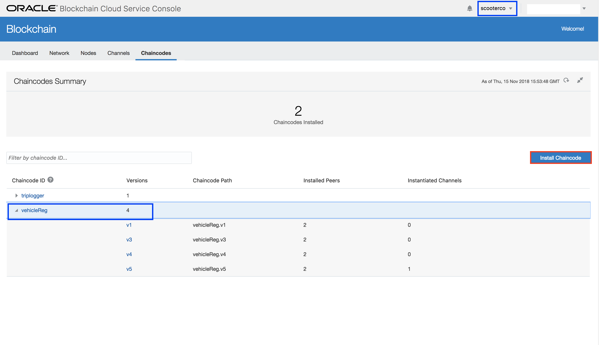
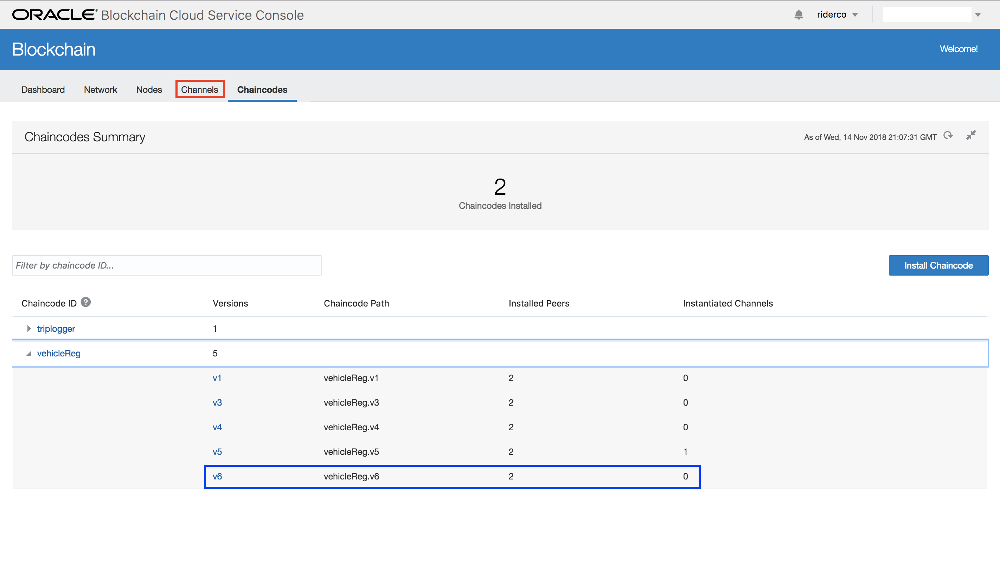

# Lab 300: Updating Chaincode
## Introduction
This lab will cover updating your chaincode on your blockchain network. We will learn about preparing chaincode for a new deployment, installing updated chaincode to peers, and instantiating the updated chaincode on channels.

Business needs are changing constantly. New features need to be added and updates need to be made! Updating chaincode will allow you to keep your network in top condition.

## Objectives
- Learn about Oracle Blockchain Cloud Service's capabilities for updating chaincode.
- Understand how to handle new business logic requirements by editing chaincode.
- Install an updated chaincode to the founder and participant peers.
- Instantiate an updated chaincode version onto different channels.

## Required Artifacts
- Completed Lab 100  and 200.
- Have a Blockchain network with a Founder (CityOfTownship) and two Participan(RiderCo & ScooterCo).
- Have the vehicleReg.go and tripLogger.go chaincodes installed and instantiated on the scooter.co and rider.co channels.

---
### Step 0: Clone Artifacts
- Clone artifacts required for this lab to a local directory. We will be using them throughout all labs.   
`https://github.com/restonappdev/Oracle-Shared-Mobility-Workshop-Artifacts.git`

### Step 1: Prepare Your Chaincode
- Open up your “VehicleReg.go” chaincode in your favorite editor, I’m using Visual Studio Code here. Navigate to line 32 or where you have the “Init” function declared. This is your entry point to the chaincode. It runs when the chaincode is first deployed. 

- Navigate down to the next function on line 36 or where you have the “invoke” function declared. “Invoke" is used to call functions so that you can perform business logic with your chaincode. It routes to the correct activity based on the arguments passed in by the user.

- You may notice errors on these function names on your machine if you opened them using VS Code. No need to worry! It’s only throwing that error because you have the same "init" and "invoke" function names in “tripLogger.go”. It won’t affect the performance of the chaincode when you install and instantiate it.

- Uncomment the “else if” statement referring to "getVehiclesNotInService" on line 52 or where yours is declared. It will be enclosed in a blue box. Make sure to NOT uncomment anything outside of the blue box. 

- Once you do that, insert a tab such that the return statement is in line with the other return statements. Golang utilizes indentation for functionality so this is very important.

- Navigate to line 309 or where you have the function “getVehiclesNotInService” declared.

- Uncomment the “getVehiclesNotInService” function from line 309 to line 383 or where your function is declared. Ensure that you only uncomment that specific function and don’t miss any curly braces.

- Minimize your chaincode. Find where you saved it on your local machine and compress it to a zip file. It’s now ready to be installed and instantiated!

### Step 2: Install Your Updated Chaincode on the Founder

- Open the “Chaincodes” tab in your founder organization (CityOfTownship). 

- We’ll update the VehicleReg chaincode. Select “VehicleReg” and click the “Install Chaincode” button on the top right.

- Do the following:

    * In “Chaincode Name” write “VehicleReg”. This is the chaincode we want to upgrade.

    * In “Version” write a version number above your current number. This will vary based on how many times you’ve updated your chaincode. In your case, it will probably be “v2". But we keep the previous versions in case we want to go back to a previous state.

    * For “Target Peers” select the two peers from your founder organization.

    * Ensure “Chaincode Source” is checked “Local”.

    * Upload your updated chaincode zip file “VehicleReg.zip”.

    * Click “Install”

- You should be greeted by a green “Success” message. 

- To ensure the chaincode was installed expand the “VehicleReg” chaincode entry and look for the chaincode version you just entered. It should now be installed on 2 peers and instantiated on 0 channels.

### Step 3: Install Your Updated Chaincode on Participant ScooterCo

- Switch to your participant organization “scooterco” and navigate to the “Chaincodes” tab. If you expand the “VehicleReg” chaincode entry you’ll see that the new chaincode version has not been installed.

- Do the following:

    * Click the “Install Chaincode” button like you did for the founder organization.

    * In “Chaincode Name” write “VehicleReg”.

    * In “Version” write the same number you did for the founder organization. 

    * For “Target Peers” select the two peers from your participant organization.

    * Ensure “Chaincode Source” is checked to “Local”.

    * Upload your updated chaincode zip file “VehicleReg.zip”.

    * Click “Install”

- You should be greeted by a green “Success” message.

- To ensure the chaincode was installed expand the “VehicleReg” chaincode entry and look for the chaincode version you just entered. It should now be installed on 2 peers and instantiated on 0 channels.

### Step 4: Install Your Updated Chaincode on Participant RiderCo

- Switch to your participant organization “riderco” and navigate to the “Chaincodes” tab. If you expand the “VehicleReg” chaincode entry you’ll see that the new chaincode version has not been installed.

- Do the following:

    * Click the “Install Chaincode” button like you did for the other organizations.

    * In “Chaincode Name” write “VehicleReg”.

    * In “Version” write the same number you did for the founder organization. 

    * For “Target Peers” select the two peers from your participant organization.

    * Ensure “Chaincode Source” is checked to “Local”.

    * Upload your updated chaincode zip file “VehicleReg.zip”.

    * Click “Install”

- You should be greeted by a green “Success” message.

- To ensure the chaincode was installed expand the “VehicleReg” chaincode entry like you did for the other organizations. The new chaincode will be installed on two peers and instantiated on 0 channels.

### Step 5: Instantiate Your Updated Chaincode on the riderco.channel

- The next task is to instantiate the updated chaincode on each channel.

- Return to the founder organization “CityOfTownship” and navigate to the “Channels” tab. Click on “riderco.channel” as shown below.

- On the side menu click “Instantiated Chaincodes”.

- Click the hamburger menu for “VehicleReg” and then select “Upgrade”

- Specify the version number you provided when installing the chaincode on each organization and choose a peer from the list.

- We don’t need to worry about “Initial Argument” or “Transient Map”. Select “Upgrade”.

- The instantiation process will take more time to complete than installation. Once finished, your instantiated chaincode version will be updated as shown!

- Once you’re happy with that click the “Channels” menu to return to the list of channels.

### Step 6: Instantiate Your Updated Chaincode on the scooterco.channel

- Now we’ll do the same thing with ScooterCo participant. Click “scooterco.channel” from the list of channels.

- On the side menu click “Instantiated Chaincdodes”.

- Click the hamburger menu for “VehicleReg” and then select “Upgrade”

- Specify the version number you provided when installing the chaincode on each organization and choose a peer from the list.

- We don’t need to worry about “Initial Argument” or “Transient Map”. Select “Upgrade”.

- Once finished, your instantiated chaincode version will be updated as shown! Now navigate back to the “Chaincodes” tab as highlighted below.

- Expand the “VehicleReg” chaincode entry. Your updated chaincode version is now installed and instantiated on both channels! Good job!

- Congratulations, you've completed Lab 300! You are now ready to move on to Lab 400.
