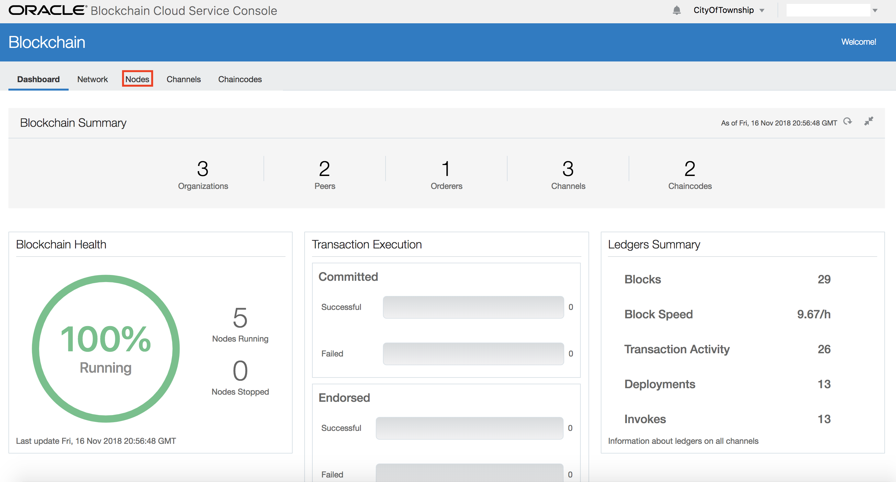

# Lab 400: Interacting With Your Network Through Rest API
## Introduction
This lab will go into detail on interacting with your Blockchain network via Rest API Gateway. You’ll learn how to find your Rest gateway, set up a Postman environment to send Rest API requests to your network, register new vehicles to a channel, and query information from your state database.

Interacting with your network via Rest Gateway is foundational to developing Blockchain applications. They allow you to interact with chaincode (smart contracts) to perform your business logic.

## Objectives
- Learn about the Rest gateway features of Oracle Blockchain Service.
- Examine and understand how chaincode invocations and queries work.
- Interact with your channels via Rest API Gateway.
- Setup and utilize Postman to test your smart contract functions.
- Add objects to your blockchain network.
- Query information from your blockchain network. 

## Required Artifacts
- Have Postman installed on your machine.
- Completed labs 100, 200, and 300 of this workshop. 
- Have the updated vehicleReg.go and tripLogger.go chaincodes installed and instantiated on the scooter.co and rider.co channels.

---
### Step 1: Find the Rest Gateway
- First, we need to get the Rest gateway for our blockchain network to interact with it. Open the founder and navigate to the “nodes” tab. 

- Copy the Rest gateway address shown in the screenshot below. You’ll need this later on. The blacked out part is the IP address.

### Step 2: Examine the "registerVehicle" Function
- Now open the “vehicleReg.go” file from the location you cloned the artifacts to. This is the chaincode used for managing vehicles.

- Scroll down to line 102 or where you have the function “registerVehicle” placed as highlighted in the screenshot. Note the structure of the function. 

- It takes three arguments: The serial number, owner, and vehicle type. Since the vehicle will start out as not in service, CurrentLocation and Inservice variables are set for you. It then sets the value to a JSON text result in the form of a byte array. And finally, it uses the “PutState” function to place the specified key and value into the transaction’s write set as a data-write proposal.

- Go ahead and minimize the chaincode. We'll be looking at it later.

### Step 3: Setup Your Postman Environment

- Open your Postman application.

- Click the "New" button to create a new Request

- To save this request, give it a name. You can name it OBCS or anything else you'd like.

- Create a new collection with your desired name.

- Make sure the newly made collection is selected. The “Save to ___” button should now be clickable. Click the button to proceed to the next step.

- Great! Now you are ready to interact with your network via REST API.
Your new environment should look similar to the screenshot below. Don’t be worried though if the tab is labelled differently on your screen.

### Step 4: Prepare Your Call to the Rest Gateway

- Do the following in the "Headers" section of your new tab:

-   a).	Set a new header of “Content-Type” to value “application/json” as shown below. This is the structure our REST gateway will be expecting. 
-   b).	Set the request type from “GET” to “POST”. You will always be using “POST” requests to interact with your chaincode even on queries.
-   c).	Copy the REST gateway into the address bar as shown below. Append /bcsgw/rest/v1/transaction/invocation to the end of it.

- Navigate to the "Body" tab in Postman.

- Do the following in the "Body" section:

  * Ensure that the request type is set to “POST”.

  * Ensure your gateway address is entered correctly.

  * Select the radio button for “raw”
  * Ensure the drop down to the right of “binary” is set to “JSON (application/json).
  * Copy the Body of your request as shown. We specify which “channel” to write our invocation to such that data stays hidden from organizations on the network. The “chaincode” parameter specifies which chaincode to use. “Method” refers to which function in our chaincode we’re referring to while “version” specifies which current iteration we’re using. And “args” takes the correct number and type of arguments to pass.
  * Double check to make sure you didn't miss a comma, quotation mark, or colon!

  * Hit the "Send" button on the top right.

- If everything went well you’ll see a message like the one shown below. The returnCode should be “Success” and a transaction ID will be shown.

- Your vehicle is now recorded! If you want to add more vehicles, you are free to enter in a unique serial key for each one.

- Press the "+" button to open up another tab for our next transaction. Minimize Postman.

### Step 5: Examine the "seeAllVehicles" Function

- Reopen the chaincode “vehicleReg.go”. Scroll to line 62 or where you have the function “seeAllVehicles” written.

- Note the function’s structure. “GetStateByRange” queries all keys between the lower and upper values you provide. Since we want all of them, you can simply put a blank string in for both parameters.

- We then iterate through the response, writing the result to a buffer and then printing it out. 

- Minimize the chaincode and return to your Postman window.

### Step 6: Query the State Database Using Your Rest Gateway

- Navigate to your second tab and then to the “Headers” section. 

- Do the following in the "Headers" section of your new tab:

-   a).	Set a header with the key of “Content_Type” and value “application/json” as shown by the below screenshot.
-   b). Paste your address from the previous request into the address bar. Change “invocation” to “query”. 

- Navigate to the "Body" tab in Postman.

- Do the following in the "Body" section:

  * Ensure that the request type is set to “POST”. Even though we're querying data, we still need to use the "POST" method to talk to our blockchain.

  * Ensure your gateway address is entered correctly with "query" instead of "invocation" at the end.

  * Select the radio button for “raw”.

  * Ensure the drop down to the right of “binary” is set to “JSON (application/json).

  * Copy the Body of your request as shown. The “args” section is empty as we are not inserting any information.

- Hit the "Send" button on the top right.

- If everything went well you’ll see a response like the one shown below. Your response will depend on how many vehicles you previously registered.

- Recall the structure of the “PutState” function with your “registerVehicle” function. You submitted both a key and a value. You specified the key as the serial number and the vehicle object also has the serial number stored in it, which is why you see it twice for each record. 

- The “GetStateByRange” searches specifically for the keys.

- Press the “+” to open a new tab for our next query.

### Step 7: Examine the "getVehiclesNotInService" Function

- Reopen “vehicleReg.go”. Scroll to line 309 or where you have the function “getVehiclesNotInService” written. 

- Note the function’s structure. It’s very similar at first to “seeAllVehicles”. It uses a “GetStateByRange” to retrieve the desired vehicle values.

- The difference is though we’re only looking for vehicles that are not in service. Therefore, for each iteration through the query response we perform a check to see if the vehicle’s “InService” value is false. 

- This way we have more control over what is returned as opposed to returning the entire value. 

- Minimize the chaincode and return to your Postman window.

### Step 8: Query the State Database Based on a Condition

- Navigate to your third tab and then to the “Headers” section. 

- Do the following in the "Headers" section of your new tab:

  * Set a header with the key of “Content_Type” and value “application/json” as shown by the below screenshot.
  * Paste your address from the previous request into the address bar. Ensure the ending path is still "query".

- Navigate to the "Body" tab in Postman.

- Do the following in the "Body" section:

  * Ensure that the request type is set to “POST”. 
  * Ensure your gateway address is entered correctly with "query" instead of "invocation" at the end.
  * Select the radio button for “raw”
  * Ensure the drop down to the right of “binary” is set to “JSON (application/json).
  * Copy the Body of your request as shown. The “args” section is empty as we are not inserting any information.

- Hit the "Send" button on the top right.

- You should see a response like the one shown below. Your response will depend on how many vehicles you’ve registered and put into service. 

- Note the difference in response structure between “getVehiclesNotInService” and “seeAllVehicles”. In “getVehiclesNotInService” we are only showing the value associated with the key. That's why you see the serial number only once.

- Additionally, if you have access to an Oracle Blockchain Cloud Service instance you can implement a SQL Rich query utilizing Oracle’s BerkeleyDB resource outlined in the OBCS workshop. 

- The SQL Rich function is commented out in the "VehicleReg.go" chaincode along with a sample argument above it. It will not work on the Docker Image network though.
