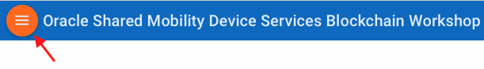

# Oracle Shared Mobility Device Services Blockchain Workshop - Docker Version

This workshop walks you through all the steps to get started with using **Oracle Blockchain Cloud Service**. This lab has two versions. This version is for those who were provided access to an OCI instance with a Docker image running the Oracle Blockchain Service. If you did not receive access to such an instance, you should go to the version of this lab [using an Oracle Cloud account](https://github.com/restonappdev/Oracle-Shared-Mobility-Workshop-Cloud/blob/master/README.md).

In this lab, you'll learn how to create and configure a Founder-Participant blockchain network, set up channels between the organizations in the network, install/instantiate chaincodes, update those chaincodes, and interact with your blockchain network via REST proxy gateways.

In this lab, we are creating a network to help a local government, the *City of Township*, help track and regulate the Shared Mobility Device Services in their city. Shared Mobility Device Services provide devices like bicycles and electric scooters that can be rented for short durations to help people move around urban areas. Local governments need a way to track the usage of those devices in way that is tamper-proof. Meanwhile, the SMDS vendors *RiderCo* and *ScooterCo* want to comply with local regulations while making sure that their ridership information is only available to the city and cannot be accessed by their competition. This is a situation where using a blockchain network has clear advantages.

## Shared Mobility Device Services - Main Features
- Let SMDS vendors register and manage a fleet of vehicles for consumers to rent.
- Handle security through separate channels preventing organizations from accessing data from their competitors.
- Allow for vehicle trips to be logged and retrieved.

## Goals
- Understand the Oracle Blockchain Application interface
- Create a new blockchain network
- Learn about channels and their purpose
- Learn how to write chaincode and utilize it
- Learn how to update chaincode on a network
- Learn how to make Rest calls to a Rest Gateway
- Have a full understanding of creating a network from provisioning to updating

## Prerequisites
* **Lab 100**
  * The IP address for the OCI instance running the Oracle Blockchain Application.
  * The username and password to access the Oracle Blockchain Application on that instance.
* **Lab 200**
  * The chaincode files *tripLogger.go.zip* and *vehicleReg.go.zip* from the artifacts repository.
* **Lab 300**
  * Install git
* **Lab 400**
  * Install Postman

## How to View the Lab Guides
- The Lab Guides are best viewed using the Workshop's [GitHub Pages Website URL](https://restonappdev.github.io/Oracle-Shared-Mobility-Workshop/?page=README.md)

- Once you are viewing the Workshop's GitHub Pages website, you can see a list of Lab Guides at any time by clicking on the **Menu Icon**

      

**[Navigate to Lab 100](Lab100.md)**
